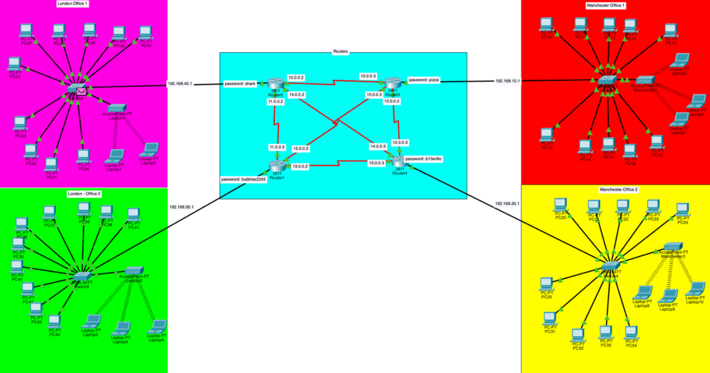

# security-network-architecture
A cybersecurity project demonstrating secure network design, firewall rules, SIEM monitoring, and incident response.

## Screenshots

### Network Topology
This screenshot shows the overall network topology connecting multiple offices in London and Manchester. The design uses network segmentation to reduce attack surfaces and improve scalability.

### DHCP Address Assignment
This screenshot demonstrates hosts receiving IP addresses automatically via DHCP, including subnet mask and default gateway configuration.

### Same-Subnet Connectivity
This test confirms successful communication between hosts within the same subnet using the ping command.

### Cross-Subnet Connectivity
This test demonstrates successful communication between hosts on different subnets, verifying correct routing between network segments.

### RIP Dynamic Routing
This screenshot shows RIP routing enabled on the router, allowing dynamic route exchange between networks to ensure connectivity across all locations.

### Secure Shell (SSH) Configuration
This screenshot confirms that SSH is enabled on the router, providing secure remote access for network administration.

